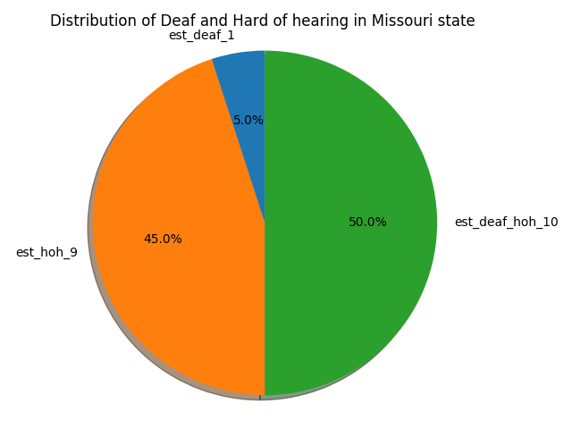
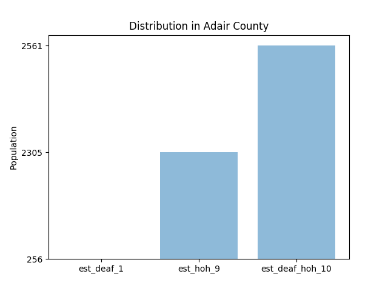
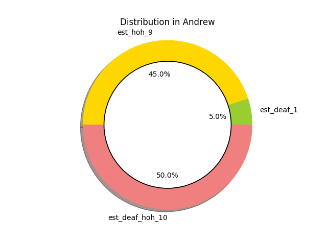
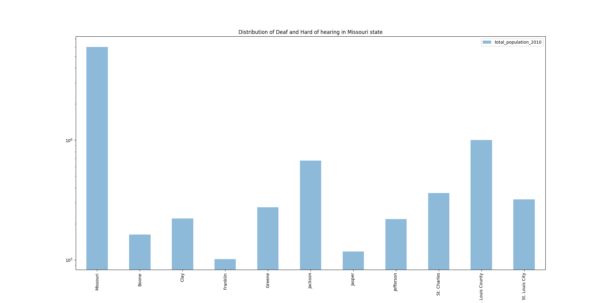
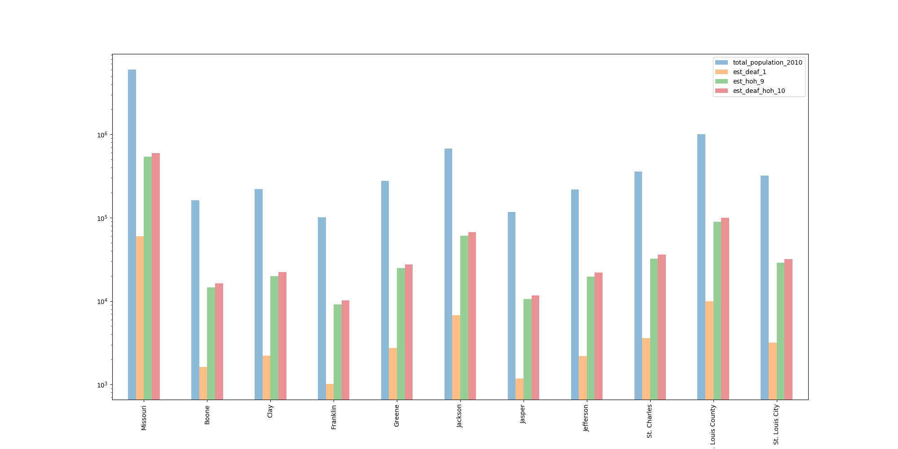

# Visualiztion of Deaf and Hard of Hearing Statistics of the Missouri State.

Authors:  **Saurabh S Kulkarni**, **Keval U Patel**, and **Harsh S Dalal.**

---


---

## Introduction
-This is a state website of Missouri which basically displays the data of many things like 
 liqour consumption based on area, active law agencies, Unemployment agencies, etc.
-This website shares the Deaf and Hard of Hearing Statistics of the Missouri State.
-So this data will be imported and accordingly visualizations would be made in the form of graphs.

---

## Sources
- Source code 
1)https://dev.socrata.com/foundry/data.mo.gov/3vxz-wrn6
2)https://pythonspot.com/matplotlib-bar-chart/
3)https://matplotlib.org/3.2.1/api/_as_gen/matplotlib.pyplot.pie.html
4)https://seaborn.pydata.org/generated/seaborn.boxplot.html
5)https://python-graph-gallery.com/161-custom-matplotlib-donut-plot/

- The code retrieves data from
1) https://data.mo.gov/
2)https://dev.socrata.com/foundry/data.mo.gov/3vxz-wrn6
---

## Explanation of the Code
First we install Sodapy by pip install Sodapy.
Here, first we import the data through Sodapy and Socrata API.
Along with the API, we also import all the necessary libraries for the proper execution of the code as well as visualising the data.

``` 
import matplotlib.pyplot as plt
import pandas as pd
import numpy as np
from sodapy import Socrata
import os
import seaborn as sns
```
 
After the data has been called using API client, by providing app_token, username and password and arranged in the form of table/ rows and columns also known as the panda dataframe

```
app_token = os.environ.get('APP_TOKEN_ONLINEDATA_ASSIGNMENT')
username = os.environ.get('USER_ONLINEDATA')
password = os.environ.get('PASS_ONLINEDATA')
client = Socrata("data.mo.gov",
                 app_token,
                  username=username,
                  password=password)

results = client.get("3vxz-wrn6")
```
We will manipulate the dataframe to plot pie, bar and donut, and adjacent bar plots,
results_df contains data which is fetched from API,
to get column names, we will use results_df.columns.
to get data for pie chart we will access it by [0]th row of dataframe
to get data for bar chart we will access it by [1]th row of dataframe
to get data for donut chart we will access it by [2]th row of dataframe
  
```
results_df = pd.DataFrame.from_records(results)
all_colms = list(results_df.columns)
labels = all_colms[2:]
px = list(results_df.iloc[0])
sizes = px[2:]
bar = list(results_df.iloc[1])
donut = list(results_df.iloc[2])
size_for_bar = bar[2:]
size_for_donut = donut[2:]
fig1, ax1 = plt.subplots()
```
The data has been plotted in three types, bar graph, pie chart and a circular pie chart (donut / torus shape).
First We will plot pie chart of 'Distribution of Deaf and Hard of hearing in Missouri state'
we will asign labels to column names and sizes to values in Missouri state
``` 
ax1.pie(sizes, labels=labels, autopct='%1.1f%%',
        shadow=True, startangle=90)
ax1.axis('equal')  
plt.title('Distribution of Deaf and Hard of hearing in Missouri state')
plt.tight_layout()
```
Finally, we visualize the data. We save our plot as a .png image:
```
plt.savefig('figureone.png')
plt.close() 	
```
The output from this code is shown below:



Next we will plot bar plot of 'Distribution in Adair County'
In this we will column names as labels and place them as xticks as well.
size_for_bar is values for Adair county
```
objects = labels
y_pos = np.arange(len(objects))
performance = size_for_bar

plt.bar(y_pos, performance, align='center', alpha=0.5)
plt.xticks(y_pos, objects)
plt.ylabel('Population')
plt.title('Distribution in Adair County')
plt.savefig('figuretwo.png')
plt.close()
```
The output from this code is shown below:

 

```
plotting the Donut plot of 'Distribution in Andrew' county by using customized colors
In this size_for_donut is values for Andrew county, labels are column names.
We will create the centre circle to make a shape like donut.

```
colors = ['yellowgreen', 'gold', 'lightcoral']
explode = (0, 0, 0)  # explode a slice if required

plt.pie(size_for_donut, explode=explode, labels=labels, colors=colors,
        autopct='%1.1f%%', shadow=True)
        
centre_circle = plt.Circle((0,0),0.75,color='black', fc='white',linewidth=1.25)
fig = plt.gcf()
fig.gca().add_artist(centre_circle)

plt.axis('equal')
plt.title('Distribution in Andrew')
plt.savefig('figurethree.png')
plt.close()
``` 
The output from this code is shown below:


``` 

Here, The columns were coming in object form , so that to plot we have to convert them into numeric form. That's why we use "pd.to_numeric" code for that. And applied it to all columns except "county". Because "county" itself is a string.

```
results_df['est_deaf_1'] = pd.to_numeric(results_df['est_deaf_1'])
results_df['total_population_2010'] = pd.to_numeric(results_df['total_population_2010'])
results_df['est_hoh_9'] = pd.to_numeric(results_df['est_hoh_9'])
results_df['est_deaf_hoh_10'] = pd.to_numeric(results_df['est_deaf_hoh_10'])
```
Then, for plotting we need to set "county" as an index for this dataframe. So, we have used "df.set_index" for it.

```
results_df = results_df.set_index('county')
```
For the 1st bar plot, we can plot it directly without using any filters. But if we do that then the graph will be very complicated due to the large size of that.
For the 1st bar plot, we can plot it directly without using any filters. But if we do that then the graph will be very complicated due to the large size of that. 

So, we first filter the data with "total population" > 100000 (here, we can use any number as per requirements). 

Furthermore, we have defined a new dataframe with just one column "total population" and plot the bar graph. Here,we already set  "county" as an index so it will come in X-axis. 

In the bar graph, we used "logy = True" because our dataset has so many differences in their numbers and to plot that all together we used "logy". Because of that, in Y-axis numbers will come in a power of 10. "rot = 90" is to set x axis labels at 90 degree. And aligned it in the center of the respective bar with the help of "align = 'center'". Used "alpha" to set the color density of the bar and gave it required figure size and title.

At the end, we saved it as a png file by using "plt.savefig" code.
```
df = results_df[results_df['total_population_2010']>100000]
df = df[['total_population_2010']]
df.plot.bar(logy =True, rot = 90, title="Distribution of Deaf and Hard of hearing in Missouri state",align='center', alpha=0.5,figsize=(20,10));
plt.savefig('figurefour.png')


```
Output of image is:


``` 

For the 2nd plot, we took the same filter which we used in the 1st plot. And then create a new dataframe with four columns and plot the bar graph. 

In this graph, we are getting 4 columns for each "county" and we can compare all counties on the basis of this. Also, we have used the same codes which we used to plot the 1st graph using "df.plot.bar".
At the end, we saved it as a png file by using "plt.savefig" code.
```
df = results_df[results_df['total_population_2010']>100000]
df = df[['total_population_2010','est_deaf_1','est_hoh_9','est_deaf_hoh_10']]
df.plot.bar(rot=90, logy =True, align='center', alpha=0.5, figsize=(20,10));
```
Output of image is:


---

## How to Run the Code

1. Open a terminal window.

2. Change directories to where `kulkarn3_kevalupe_harshsun_Missouri_Demographics.py` is saved.

3. Type the following command:
	```
	python kulkarn3_kevalupe_harshsun_Missouri_Demographics.py.py
	```

---

## Suggestions
In addition to this, we can plot stacked version of bar plot per county in state.  

